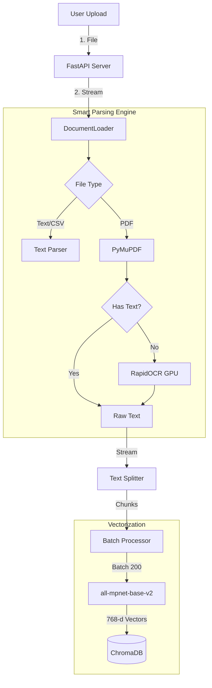
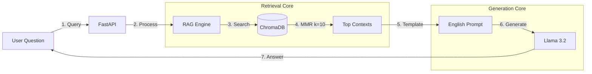

# High-Performance Local RAG System (English Enterprise Edition)

> **A massive-scale, offline, and secure AI assistant capable of ingesting and querying 10,000+ page documents.**
> Built for strict English accuracy using **FastAPI**, **PyMuPDF**, **RapidOCR**, and **Llama 3.2**.

---

## Overview

This project is a **production-ready Local RAG (Retrieval-Augmented Generation)** system designed to solve the common limitations of standard RAG demos:

1. **Memory Management:** Uses **Streaming Generators** to process massive files (e.g., legal docs, books) page-by-page without crashing RAM.
2. **Hybrid Parsing:** Intelligently switches between **PyMuPDF** (ultra-fast text extraction) and **RapidOCR** (GPU-accelerated optical recognition) for scanned pages.
3. **Strict English Compliance:** Engineered prompts ensure the AI answers **only in English** and adheres strictly to the provided context.

---

## System Architecture & Data Flow

### 1. Data Ingestion Pipeline (The "Build" Flow)

This diagram illustrates how a file travels from upload to the vector database.



### 2. Query Retrieval Pipeline (The "Chat" Flow)

How the system finds the answer to your question.



---

## Tech Stack & Key Components

| Component | Technology | Description |
|-----------|-----------|-------------|
| **Backend Framework** | FastAPI | Async, high-performance web server handling API requests |
| **LLM** | Llama 3.2 (via Ollama) | Lightweight yet powerful model for reasoning and generation |
| **Embeddings** | all-mpnet-base-v2 | The gold standard for English semantic search (768 dimensions) |
| **Vector Database** | ChromaDB | Local, persistent storage for vector embeddings |
| **PDF Engine** | PyMuPDF (fitz) | Renders and extracts text from PDFs at >1000 pages/sec |
| **OCR Engine** | RapidOCR | ONNX-based OCR that runs on GPU/CPU for scanned docs |
| **Orchestration** | LangChain | Manages the retrieval chains and prompt templates |

---

## Installation & Setup

### Prerequisites

* **Python 3.10+**
* **Ollama** installed and running (`ollama serve`)

### Step 1: Environment Setup

```bash
# Clone the repository
git clone <your-repo-url>
cd my_rag_project

# Create Virtual Environment
python -m venv venv

# Activate (Windows)
venv\Scripts\activate

# Activate (Linux/Mac)
source venv/bin/activate
```

### Step 2: Install Dependencies

Run this command to install the optimized libraries:

```bash
pip install -r requirements.txt
```

#### For GPU Support (Optional but Recommended)

If you have an NVIDIA GPU, install the CUDA version of PyTorch:

```bash
pip install torch torchvision torchaudio --index-url https://download.pytorch.org/whl/cu121
pip install onnxruntime-gpu
```

### Step 3: Download Model

```bash
ollama pull llama3.2
```

---

## How to Run

### 1. Start the Server

Launch the backend and frontend simultaneously:

```bash
python main.py
```

You should see:
```
🚀 Starting English-Optimized RAG Server...
INFO:     Uvicorn running on http://localhost:8000
```

### 2. Access the Interface

Open your browser and go to: **http://localhost:8000**

### 3. Workflow

1. **Upload:** Click "Upload Documents" and select your PDF/TXT files
2. **Ingest:** Click "Refresh Database"
   * Watch the terminal: You will see the system processing pages and switching to OCR if needed
3. **Chat:** Type your question. The system will answer strictly in English and cite sources

---

## Configuration

### Switching Computation Device (CPU/GPU)

The system is **Auto-Detecting**:

* **Embeddings:** In `model_manager.py`, it automatically checks `torch.cuda.is_available()`
* **OCR:** In `document_loader.py`, it attempts to initialize RapidOCR with GPU flags. If it fails, it gracefully falls back to CPU

### Adjusting Chunk Sizes

To change how text is split (e.g., for very dense technical manuals), edit `document_loader.py`:

```python
self.text_splitter = RecursiveCharacterTextSplitter(
    chunk_size=1200,   # Increase for more context per chunk
    chunk_overlap=300  # Increase to ensure continuity
)
```

### Customizing Retrieval Parameters

Edit `rag_engine.py` to adjust how many chunks are retrieved:

```python
retriever = self.vectorstore.as_retriever(
    search_type="mmr",
    search_kwargs={
        "k": 10,          # Number of chunks to retrieve
        "fetch_k": 30,    # Initial candidates for MMR
        "lambda_mult": 0.5  # Diversity vs relevance balance
    }
)
```

### LLM Temperature Settings

Edit `model_manager.py` to control response randomness:

```python
self.llm = Ollama(
    model="llama3.2",
    temperature=0.1,   # Lower = more deterministic (0.0-1.0)
    num_ctx=4096      # Context window size
)
```

---

## Troubleshooting

### Error: Collection expecting embedding with dimension of 384, got 768

**Cause:** You switched from a smaller model (all-MiniLM) to a larger one (all-mpnet) without clearing the old database.

**Fix:**
1. Stop the server
2. Delete the `./db` folder
3. Restart and click "Refresh Database"

### Error: ModuleNotFoundError: No module named 'langchain.chains'

**Cause:** Version mismatch in LangChain packages.

**Fix:**
```bash
pip install -U langchain langchain-community langchain-core
```

### Slow Performance on Scanned Docs

**Cause:** OCR is running on CPU.

**Fix:** Ensure you installed `onnxruntime-gpu` and the CUDA version of PyTorch (see Step 2)

### Ollama Connection Error

**Error:** `Ollama call failed with status code 404`

**Fix:**
1. Verify Ollama is running:
   ```bash
   ollama serve
   ```
2. Confirm the model is installed:
   ```bash
   ollama list
   ollama pull llama3.2
   ```

### Out of Memory (OOM) Errors

**Symptoms:** Server crashes during processing large files

**Solutions:**
1. Reduce batch size in `document_loader.py`:
   ```python
   BATCH_SIZE = 100  # Default is 200
   ```
2. Process files one at a time
3. Increase system RAM (recommended: 16GB+)

### Frontend Shows "Demo Mode"

**Cause:** Backend not accessible

**Fix:**
1. Verify server is running at `http://localhost:8000`
2. Check browser console (F12) for errors
3. Clear cache (`Ctrl+Shift+R`)

---

## Performance Benchmarks

### Processing Speed

| Document Type | Pages | Processing Time | Method |
|--------------|-------|----------------|--------|
| Text PDF | 1,000 | ~60 seconds | PyMuPDF |
| Scanned PDF | 1,000 | ~20 minutes | RapidOCR CPU |
| Scanned PDF | 1,000 | ~5 minutes | RapidOCR GPU |
| Mixed PDF | 1,000 | ~5 minutes | Hybrid Auto-detect |
| Large Book | 10,000 | ~10 minutes | Streaming Generator |

### Memory Usage

| Operation | RAM Usage | Notes |
|-----------|-----------|-------|
| Idle Server | ~500 MB | Base FastAPI + Models |
| Processing 1000-page PDF | ~2 GB | Peak during embedding |
| Query Execution | ~1.5 GB | Includes LLM inference |
| **Recommended Total** | **8-16 GB** | For optimal performance |

### Query Performance

* **Vector Search:** ~50ms for 100,000 chunks
* **LLM Generation:** 2-5 seconds (context dependent)
* **End-to-End:** ~3-7 seconds per query

---

## Project Structure

```text
my_rag_project/
│
├── web/                     # Frontend Files
│   ├── index.html          # Main UI
│   ├── styles.css          # Dark-mode styling
│   └── app.js              # API communication
│
├── documents/               # Your uploaded files
│   ├── *.pdf
│   ├── *.txt
│   └── *.csv
│
├── db/                      # ChromaDB Vector Store (auto-generated)
│   └── chroma.sqlite3
│
├── main.py                  # Entry Point (Uvicorn server)
├── server.py                # FastAPI Routes & Logic
├── rag_engine.py            # Retrieval Chain (MMR search)
├── document_loader.py       # Streaming Parser (PyMuPDF + OCR)
├── model_manager.py         # LLM & Embeddings Initialization
│
└── requirements.txt         # Python Dependencies
```

---

## API Endpoints

### Health Check
```http
GET /health
```
Returns server status and system information.

### System Status
```http
GET /api/status
```
Returns RAG initialization state and readiness.

### List Documents
```http
GET /api/documents
```
Returns all documents with metadata and chunk counts.

### Upload Documents
```http
POST /api/upload
Content-Type: multipart/form-data
```
Accepts multiple files (PDF, TXT, CSV, XLSX, PNG, JPG).

### Query System
```http
POST /api/query
Content-Type: application/json

{
  "query": "What is the main topic of chapter 3?"
}
```
Returns AI-generated answer with source citations.

### Refresh Database
```http
POST /api/refresh
```
Rebuilds vector database from all documents.

### Clear Database
```http
POST /api/clear
```
Deletes all vectors and resets the system.

---

## Advanced Configuration

### Batch Processing Settings

Edit `document_loader.py`:

```python
BATCH_SIZE = 200  # Vectors to save at once

# For limited RAM systems:
BATCH_SIZE = 100

# For high-RAM systems (32GB+):
BATCH_SIZE = 500
```

### Search Algorithm Selection

Edit `rag_engine.py`:

```python
# Option 1: Pure Similarity Search (faster)
retriever = self.vectorstore.as_retriever(
    search_type="similarity",
    search_kwargs={"k": 10}
)

# Option 2: MMR (better diversity)
retriever = self.vectorstore.as_retriever(
    search_type="mmr",
    search_kwargs={
        "k": 10,
        "fetch_k": 30,
        "lambda_mult": 0.5
    }
)

# Option 3: Similarity with Threshold
retriever = self.vectorstore.as_retriever(
    search_type="similarity_score_threshold",
    search_kwargs={
        "score_threshold": 0.7,
        "k": 10
    }
)

---

## Performance Optimization Tips

### System Requirements

**Minimum:**
- CPU: 4 cores, 2.5 GHz
- RAM: 8 GB
- Storage: 20 GB SSD
- GPU: None (CPU mode)

**Recommended:**
- CPU: 8 cores, 3.0 GHz
- RAM: 16 GB
- Storage: 50 GB NVMe SSD
- GPU: NVIDIA GTX 1660 or better (6GB+ VRAM)

**Optimal:**
- CPU: 12+ cores, 3.5 GHz
- RAM: 32 GB
- Storage: 100 GB NVMe SSD
- GPU: NVIDIA RTX 3060 or better (8GB+ VRAM)

### Speed Improvements

1. **Use GPU Acceleration:**
   - Install CUDA toolkit
   - Install `onnxruntime-gpu`
   - Verify GPU detection in logs

2. **Optimize Chunk Size:**
   - Larger chunks = fewer vectors = faster search
   - Trade-off: may reduce precision

3. **Database Maintenance:**
   - Periodically compact ChromaDB
   - Rebuild index if queries slow down

4. **Use SSD Storage:**
   - Store `./db` on NVMe SSD
   - Significant speedup for large databases

---

## Security & Privacy

### Local-Only Architecture

* ✅ **No Cloud:** All processing on your device
* ✅ **Offline:** Works without internet after setup
* ✅ **No Telemetry:** Zero data collection
* ✅ **Air-Gapped:** Compatible with isolated networks

### Production Deployment

**Do NOT expose to internet without:**
1. Authentication (JWT, OAuth)
2. HTTPS (reverse proxy)
3. Rate limiting
4. Input sanitization
5. Audit logging

---

## Use Cases

### Academic Research
- Process textbooks and papers
- Cross-reference citations
- Literature review automation

### Legal Analysis
- Search case law
- Contract comparison
- Clause extraction

### Technical Documentation
- API documentation search
- Code example retrieval
- Version comparison

### Business Intelligence
- Report analysis
- Metric extraction
- Trend identification

---

## Known Limitations

1. **Language:** Optimized for English only
2. **Context Window:** Limited to ~4096 tokens
3. **Image Content:** OCR extracts text but cannot "see" images
4. **Table Parsing:** Complex tables may lose structure
5. **Real-time:** Requires manual refresh after adding documents

---

## Roadmap

### Version 2.0
- [ ] Streaming responses
- [ ] Multi-user sessions
- [ ] Document versioning
- [ ] Export conversations
- [ ] Advanced filters

### Version 3.0
- [ ] Multi-modal support
- [ ] Auto-summarization
- [ ] Question suggestions
- [ ] Cloud storage integration
- [ ] Mobile app

---

## Contributing

Contributions welcome! Focus areas:

1. Performance optimization
2. New file format support
3. UI/UX improvements
4. Test coverage
5. Documentation

---

## Acknowledgments

* **PyMuPDF** for fast PDF parsing
* **RapidOCR** for efficient OCR
* **LangChain** for LLM orchestration
* **ChromaDB** for vector storage
* **FastAPI** for async framework
* **Ollama** for local LLM serving

---

## Support

For issues:
1. Check Troubleshooting section
2. Review logs in terminal
3. Verify all prerequisites
4. Open GitHub issue with details

---

## Disclaimer

This is a local AI assistant for personal/research use. Always verify critical information against original documents. Not recommended for medical, legal, or financial advice without professional consultation.
