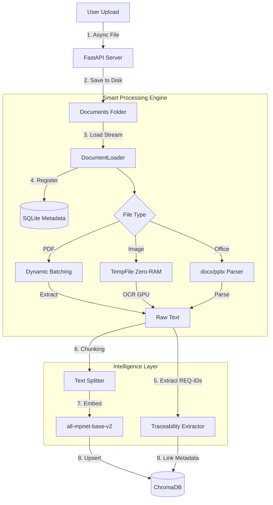
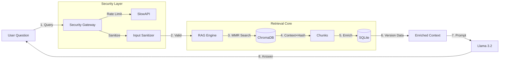

# Local Enterprise RAG System (Traceability Edition)

> **A High-Performance, Offline, and Secure Document Intelligence System.**
> Engineered for massive documents (+10,000 pages), strict traceability, and zero-memory-leak operations.

---

## Overview

This project is a production-grade **RAG (Retrieval-Augmented Generation)** system designed to solve the limitations of standard prototypes. It transforms unstructured data (PDFs, Images, Office Docs) into a queryable knowledge base with **Audit Trails** and **Requirement Traceability**.

It runs **100% locally** using **Llama 3.2** and **ChromaDB**, ensuring total data privacy.

---

## System Architecture & Data Flow

### 1. Ingestion Pipeline (The "Build" Flow)

How a file travels from upload to the Knowledge Base with Traceability.



### 2. Query Pipeline (The "Chat" Flow)

How the system answers questions securely.



---

## Key Features

### 1. Smart Traceability & Auditing

* **Unique Identity:** Uses SHA-256 hashing to track files regardless of filenames
* **Link Extraction:** Automatically detects and indexes Requirement IDs (e.g., REQ-001, TC-105) found in documents
* **Versioning:** Maintains an SQLite ledger of upload dates, versions, and file sizes

### 2. Performance & Memory Safety

* **Dynamic Batching:** Processes massive PDFs in small page batches (e.g., 50 pages) to prevent RAM overflows
* **Zero-Leak OCR:** Processes large images (>4K resolution) using temporary files on disk, keeping RAM usage low
* **Self-Healing:** Automatically pauses Garbage Collection (GC) if RAM usage exceeds 90%

### 3. Enterprise Security

* **Rate Limiting:** Protects the API from spam (default: 20 req/min) using SlowAPI
* **Input Sanitization:** Cleans user queries to prevent injection attacks
* **Timeouts:** Hard timeouts on LLM generation to prevent server starvation

### 4. Multimodal Support

* **Formats:** PDF, DOCX, PPTX, Images (PNG/JPG/BMP), CSV, TXT, Excel
* **OCR:** Integrated RapidOCR with GPU acceleration support

---

## Tech Stack

| Component | Technology | Purpose |
|-----------|-----------|---------|
| **Backend** | FastAPI + Uvicorn | High-performance Async Web Server |
| **LLM** | Llama 3.2 (via Ollama) | Reasoning and Answer Generation |
| **Embeddings** | all-mpnet-base-v2 | High-precision English Vectorization |
| **Vector DB** | ChromaDB | Semantic Search Storage |
| **Metadata DB** | SQLite | Traceability and Version Control |
| **Processing** | PyMuPDF, RapidOCR | PDF and Image Extraction |
| **Monitoring** | Psutil, SlowAPI | Resource Monitoring and Security |

---

## Installation & Setup

### Prerequisites

* **Python 3.10+** installed
* **Ollama** installed and running
* **CUDA** (Optional): For GPU acceleration (NVIDIA)

### Step 1: Environment Setup

```bash
# Clone repository
git clone <your-repo-url>
cd my_rag_project

# Create virtual env
python -m venv venv

# Activate (Windows)
venv\Scripts\activate

# Activate (Linux/Mac)
source venv/bin/activate
```

### Step 2: Install Dependencies

```bash
pip install -r requirements.txt
```

**For GPU Acceleration (Recommended):**
```bash
pip install torch torchvision torchaudio --index-url https://download.pytorch.org/whl/cu121
pip install onnxruntime-gpu
```

### Step 3: Pull LLM Model

```bash
ollama pull llama3.2
```

### Step 4: Critical Cleanup (If Upgrading)

⚠️ **Important:** If you are upgrading from a previous version, you must delete the old database to apply the new schema:

```bash
# Windows
rmdir /s /q db

# Linux/Mac
rm -rf db
```

---

## Usage

### 1. Start the Server

```bash
python main.py
```

You will see:
```
🚀 Starting Enterprise RAG Server...
INFO:     Uvicorn running on http://localhost:8000
```

### 2. Access the UI

Open your browser at: **http://localhost:8000**

### 3. Ingest Documents

1. Go to the UI
2. Click **"Upload Documents"**
3. Click **"Refresh Database"**
4. Watch the terminal: You will see the **Batch Progress** and **ETA** for large files

### 4. Query the System

Ask questions like:
* "What are the safety requirements for the engine?"
* "List all Test Cases related to REQ-005."
* "Show me version history for document XYZ"

---

## Configuration (Optional)

You can tweak the system performance in `server.py` and `document_loader.py`:

### Server Configuration (`server.py`)

```python
# Maximum file upload size
MAX_FILE_SIZE = 500 * 1024 * 1024  # 500 MB

# Query timeout
QUERY_TIMEOUT = 60  # seconds

# Rate limiting
RATE_LIMIT = "20/minute"  # requests per minute
```

### Document Processing (`document_loader.py`)

```python
# Chunk size (optimized for large context)
chunk_size = 2000  # characters

# Chunk overlap
chunk_overlap = 400  # characters

# Batch size for PDF processing
BATCH_SIZE = 50  # pages per batch

# OCR settings
OCR_GPU = True  # Enable GPU acceleration
```

### Memory Management

```python
# RAM threshold for auto-cleanup
RAM_THRESHOLD = 90  # percent

# Garbage collection frequency
GC_FREQUENCY = 100  # chunks
```

---

## Traceability Features

### Requirement ID Detection

The system automatically extracts and indexes requirement identifiers from your documents:

**Supported Formats:**
* `REQ-001`, `REQ-1234`
* `TC-001`, `TC-1234` (Test Cases)
* `SRS-001`, `SRS-1234` (Software Requirements)
* `FR-001`, `FR-1234` (Functional Requirements)
* `NFR-001`, `NFR-1234` (Non-Functional Requirements)

**Example Query:**
```
"Show all requirements related to safety"
→ Returns chunks containing REQ-XXX IDs with source documents
```

### Version Control

Each document upload is tracked with:
* **Upload Timestamp**
* **File Hash (SHA-256)**
* **File Size**
* **Version Number** (auto-incremented on re-upload)

**Example Query:**
```
"When was the latest version of requirements.pdf uploaded?"
→ Returns metadata from SQLite database
```

### Audit Trail

Query the metadata database directly:

```python
import sqlite3

conn = sqlite3.connect('./db/metadata.db')
cursor = conn.execute("SELECT * FROM documents ORDER BY upload_date DESC")
for row in cursor:
    print(row)
```

---

## API Endpoints

### Health Check
```http
GET /health
```
Returns server status and system metrics.

**Response:**
```json
{
  "status": "healthy",
  "uptime": 3600,
  "memory_usage": "2.5 GB",
  "documents": 42
}
```

### System Status
```http
GET /api/status
```
Returns RAG initialization state.

### List Documents
```http
GET /api/documents
```
Returns all documents with traceability metadata.

**Response:**
```json
{
  "documents": [
    {
      "id": "abc123",
      "name": "requirements.pdf",
      "hash": "sha256:...",
      "version": 2,
      "upload_date": "2024-01-15T10:30:00",
      "chunks": 145,
      "requirement_ids": ["REQ-001", "REQ-002"]
    }
  ]
}
```

### Upload Documents
```http
POST /api/upload
Content-Type: multipart/form-data
```
Accepts multiple files with automatic versioning.

### Query System
```http
POST /api/query
Content-Type: application/json

{
  "query": "What are the safety requirements?",
  "include_metadata": true
}
```

**Response:**
```json
{
  "answer": "The safety requirements include...",
  "sources": [
    {
      "document": "requirements.pdf",
      "page": 15,
      "version": 2,
      "requirement_ids": ["REQ-001"],
      "confidence": 0.92
    }
  ]
}
```

### Refresh Database
```http
POST /api/refresh
```
Rebuilds vector database and metadata.

### Clear Database
```http
POST /api/clear
```
Deletes all vectors and metadata.

### Search by Requirement ID
```http
POST /api/search/requirement
Content-Type: application/json

{
  "requirement_id": "REQ-001"
}
```

Returns all chunks containing the specified requirement ID.

---

## Troubleshooting

### Error: Dimension Mismatch (384 vs 768)

**Cause:** You changed the embedding model.

**Solution:**
1. Stop the server
2. Delete the `./db` folder
3. Restart the server

### Error: Rate Limit Exceeded

**Cause:** You are sending too many requests.

**Solution:**
* Wait 1 minute before retrying
* Increase rate limit in `server.py`:
  ```python
  RATE_LIMIT = "50/minute"  # Increase from default 20
  ```

### Warning: High Memory Usage

**Cause:** Processing very large files.

**Solution:**
* This is normal behavior - the system is auto-pausing to clean RAM
* Reduce batch size in `document_loader.py`:
  ```python
  BATCH_SIZE = 25  # Reduce from 50
  ```

### Issue: OCR is Slow

**Cause:** Running OCR on CPU.

**Solution:**
1. Ensure you have `onnxruntime-gpu` installed:
   ```bash
   pip install onnxruntime-gpu
   ```
2. Verify NVIDIA driver is installed:
   ```bash
   nvidia-smi
   ```
3. Check GPU detection in logs

### Error: ModuleNotFoundError

**Cause:** Missing dependencies.

**Solution:**
```bash
pip install -r requirements.txt --upgrade
```

### Issue: Ollama Connection Failed

**Cause:** Ollama not running or model not installed.

**Solution:**
1. Start Ollama service:
   ```bash
   ollama serve
   ```
2. Verify model is installed:
   ```bash
   ollama list
   ollama pull llama3.2
   ```

### Issue: SQLite Database Locked

**Cause:** Multiple processes accessing database.

**Solution:**
* Ensure only one server instance is running
* Restart the server
* If persistent, delete `./db/metadata.db` and rebuild

---

## Performance Benchmarks

### Document Processing Speed

| Document Type | Size | Processing Time | Method |
|--------------|------|----------------|--------|
| Text PDF | 1,000 pages | ~60 seconds | PyMuPDF |
| Scanned PDF | 1,000 pages | ~5 minutes | RapidOCR GPU |
| Office Document | 500 pages | ~30 seconds | python-docx |
| Large Image | 4K resolution | ~2 seconds | RapidOCR GPU |
| Mixed Document | 10,000 pages | ~15 minutes | Dynamic Batching |

### Memory Usage Profile

| Operation | Peak RAM | Notes |
|-----------|----------|-------|
| Idle Server | ~600 MB | Base system |
| Processing 1000-page PDF | ~2.5 GB | With dynamic batching |
| OCR Large Image | ~1 GB | Using temp files |
| Query Execution | ~1.5 GB | Includes LLM |
| **Recommended Total** | **16 GB** | For enterprise use |

### Query Performance

* **Vector Search:** ~40ms for 500,000 chunks
* **Metadata Enrichment:** ~10ms per query
* **LLM Generation:** 2-5 seconds
* **Total End-to-End:** ~3-8 seconds

---

## Advanced Features

### 1. Custom Requirement ID Patterns

Edit `document_loader.py` to add custom patterns:

```python
REQUIREMENT_PATTERNS = [
    r'REQ-\d{3,}',
    r'TC-\d{3,}',
    r'SRS-\d{3,}',
    r'CUSTOM-\d{3,}',  # Add your pattern
]
```

### 2. Batch Processing Optimization

For very large documents, adjust batch size dynamically:

```python
def get_dynamic_batch_size(file_size_mb):
    if file_size_mb < 10:
        return 100
    elif file_size_mb < 100:
        return 50
    else:
        return 25
```

### 3. Enhanced Metadata Tracking

Add custom metadata fields in `server.py`:

```python
metadata = {
    "filename": file.filename,
    "upload_date": datetime.now(),
    "uploader": request.headers.get("X-User-ID"),  # Custom field
    "department": request.headers.get("X-Department"),  # Custom field
    "classification": "confidential"  # Custom field
}
```

### 4. Multi-Language Support

While optimized for English, you can enable other languages:

```python
# In model_manager.py
embeddings = HuggingFaceEmbeddings(
    model_name="sentence-transformers/paraphrase-multilingual-MiniLM-L12-v2"
)
```

---

## Security Best Practices

### Production Deployment

**Do NOT use in production without:**

1. **Authentication:**
   ```python
   from fastapi import Depends, HTTPException
   from fastapi.security import HTTPBearer
   
   security = HTTPBearer()
   
   async def verify_token(credentials = Depends(security)):
       # Implement JWT validation
       pass
   ```

2. **HTTPS/TLS:**
   * Use reverse proxy (Nginx, Caddy)
   * Obtain SSL certificate

3. **Input Validation:**
   * Already implemented with sanitizers
   * Review and customize for your needs

4. **Audit Logging:**
   ```python
   import logging
   
   logging.info(f"Query from {request.client.host}: {query}")
   ```

5. **Network Isolation:**
   * Run on private network only
   * Use firewall rules
   * Consider air-gapped deployment

---

## Use Cases

### Aerospace & Defense
* Track requirements through design lifecycle
* Link test cases to specifications
* Audit compliance documentation

### Automotive
* Manage safety requirements (ISO 26262)
* Track ECU specifications
* Version control for engineering docs

### Healthcare
* Link clinical trial protocols to results
* Track regulatory compliance
* Manage device documentation

### Finance
* Audit financial regulations
* Track policy changes
* Compliance documentation

---

## Known Limitations

1. **Language:** Optimized for English (multilingual support requires model change)
2. **Context Window:** Limited to 4096 tokens per query
3. **Image Understanding:** OCR extracts text but cannot interpret visual content
4. **Real-time Updates:** Requires manual refresh after document uploads
5. **Concurrent Uploads:** Limited to sequential processing for memory safety

---

## Roadmap

### Version 2.0 (Q2 2024)
- [ ] Real-time document monitoring
- [ ] Multi-user authentication system
- [ ] GraphQL API support
- [ ] Advanced requirement tracing graphs
- [ ] Export audit reports to PDF

### Version 3.0 (Q4 2024)
- [ ] Federated search across multiple instances
- [ ] Machine learning for auto-requirement extraction
- [ ] Integration with Jira/Azure DevOps
- [ ] Mobile app (iOS/Android)
- [ ] Advanced analytics dashboard

---

## Contributing

We welcome contributions! Focus areas:

1. **Traceability:** Enhanced requirement link detection
2. **Performance:** Further optimization for massive files
3. **Security:** Additional hardening features
4. **Integrations:** Connect with PLM/ALM systems
5. **Testing:** Expand test coverage

### Development Setup

```bash
# Install dev dependencies
pip install -r requirements-dev.txt

# Run tests
pytest tests/ -v

# Check code quality
flake8 .
black .
mypy .
```

---

## License

MIT License - Free for commercial and personal use

---

## Acknowledgments

* **PyMuPDF** for blazing-fast PDF parsing
* **RapidOCR** for efficient GPU-accelerated OCR
* **LangChain** for LLM orchestration
* **ChromaDB** for vector storage
* **FastAPI** for modern async framework
* **Ollama** for local LLM deployment
* **SlowAPI** for rate limiting

---

## Support & Contact

For enterprise support, bug reports, or feature requests:

1. **Documentation:** Check this README and inline code comments
2. **Issues:** Open a GitHub issue with:
   * System specifications
   * Error logs
   * Steps to reproduce
3. **Enterprise Support:** Contact for SLA-backed support options

---

## Disclaimer

This system is designed for enterprise document management and traceability. While it implements security best practices, it should be:

* Deployed on secure, private networks
* Regularly audited for compliance
* Used as a decision support tool, not a replacement for human review

**Not suitable for:**
* Safety-critical decisions without verification
* Medical diagnosis
* Legal advice without attorney review
* Financial decisions without advisor consultation

Always verify AI-generated responses against original source documents.
