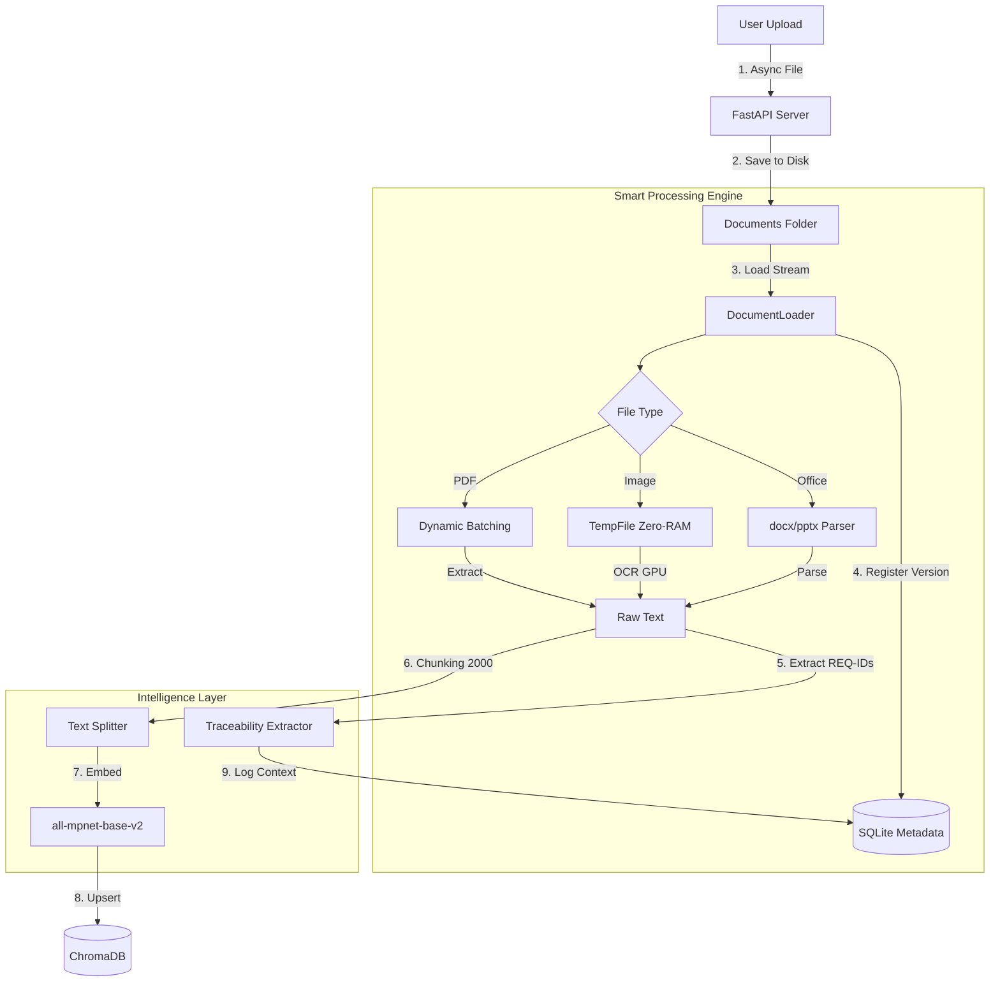
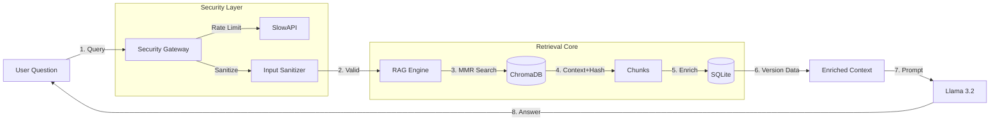

# Local Enterprise RAG System (Traceability Edition)

> **A High-Performance, Offline, and Secure AI Knowledge Base.**
> Engineered for massive documents (+10,000 pages), strict requirement traceability, and zero-memory-leak operations.

---

## Overview

This project is a production-grade **RAG (Retrieval-Augmented Generation)** system designed to bridge the gap between unstructured data (PDFs, Images) and structured compliance (Requirements Traceability).

Unlike standard RAG demos, this system features a **Traceability Auditor** that compares your documents against a "Master Requirements List" to detect gaps, orphan links, and ensure full coverage. It runs **100% locally** using **Llama 3.2** and **ChromaDB**, ensuring total data privacy.

---

## System Architecture

### 1. Ingestion Pipeline (The "Build" Flow)

How a file travels from upload to the Knowledge Base with Audit logging.



### 2. Query Pipeline (The "Chat" Flow)

How the system answers questions securely and retrieves traceability data.



---

## Key Features

### 1. Advanced Traceability Audit

* **Source of Truth:** Upload a Master Requirements List (CSV) to define what should exist
* **Gap Analysis:** Automatically generates reports identifying missing requirements not found in any document
* **Orphan Detection:** Flags links found in documents that do not exist in the Master List (e.g., typos or deprecated requirements)
* **Context Verification:** Ensures a link (e.g., REQ-001) is mentioned with meaningful context, not just a standalone string

### 2. Performance & Memory Safety

* **Dynamic Batching:** Reads massive PDFs in small page batches to prevent RAM overflow
* **Zero-Leak OCR:** Processes high-resolution images using temporary files on disk instead of loading them entirely into RAM
* **Self-Healing:** Automatically pauses Garbage Collection (GC) if RAM usage spikes above 90%

### 3. Enterprise Security

* **Rate Limiting:** Protects the API from abuse (Default: 20 requests/minute)
* **Input Sanitization:** Cleans user queries to prevent injection attacks while preserving technical IDs
* **Timeouts:** Hard timeouts on LLM generation to prevent server starvation

### 4. Multimodal Support

* **Supported Formats:** PDF, DOCX, PPTX, Images (PNG/JPG/BMP), CSV, TXT, Excel
* **OCR:** Integrated RapidOCR with optional GPU acceleration

---

## Tech Stack

| Component | Technology | Purpose |
|-----------|-----------|---------|
| **Backend** | FastAPI + Uvicorn | High-performance Async Web Server |
| **LLM** | Llama 3.2 (via Ollama) | Reasoning and Answer Generation |
| **Embeddings** | all-mpnet-base-v2 | High-precision English Vectorization |
| **Vector DB** | ChromaDB | Semantic Search Storage |
| **Metadata DB** | SQLite | Traceability and Version Control |
| **Processing** | PyMuPDF, RapidOCR | PDF and Image Extraction |
| **Auditing** | Custom Logic | Gap Analysis & Coverage Reporting |

---

## Installation & Setup

### Prerequisites

* **Python 3.10+** installed
* **Ollama** installed and running
* **CUDA** (Optional): For NVIDIA GPU acceleration

### Step 1: Environment Setup

```bash
# Clone repository
git clone repo-url
cd my_rag_project

# Create virtual env
python -m venv venv

# Activate (Windows)
venv\Scripts\activate

# Activate (Linux/Mac)
source venv/bin/activate
```

### Step 2: Install Dependencies

```bash
pip install -r requirements.txt
```

**For GPU Acceleration (Recommended):**
```bash
pip install torch torchvision torchaudio --index-url https://download.pytorch.org/whl/cu121
pip install onnxruntime-gpu
```

### Step 3: Pull LLM Model

```bash
ollama pull llama3.2
```

### Step 4: Critical Cleanup (If Upgrading)

⚠️ **Important:** If you are upgrading from a previous version, delete the `./db` folder to ensure the new SQL schema is created correctly.

```bash
# Windows
rmdir /s /q db

# Linux/Mac
rm -rf db
```

---

## Usage

### 1. Start the Server

```bash
python main.py
```

You will see:
```
🚀 Starting Enterprise RAG Server...
INFO:     Uvicorn running on http://localhost:8000
```

### 2. Access the UI

Open your browser at: **http://localhost:8000**

### 3. Configure Traceability (Optional but Recommended)

To use the Audit features, you must define your "Source of Truth":

#### Prepare Master Requirements List

Create a CSV file with the following structure:

**master_requirements.csv**
```csv
ID,Description,Category
REQ-001,System shall startup within 5 seconds,Performance
REQ-002,User authentication shall use 2FA,Security
REQ-003,Data encryption at rest using AES-256,Security
TC-001,Verify system startup time,Testing
TC-002,Test authentication flow,Testing
```

#### Upload Master List

**Option 1: Using API (Recommended for automation)**

```bash
curl -X POST "http://localhost:8000/api/traceability/master-upload" \
  -H "Content-Type: multipart/form-data" \
  -F "file=@master_requirements.csv"
```

**Option 2: Using Python**

```python
import requests

with open('master_requirements.csv', 'rb') as f:
    files = {'file': f}
    response = requests.post(
        'http://localhost:8000/api/traceability/master-upload',
        files=files
    )
    print(response.json())
```

### 4. Ingest Documents

1. Go to the UI
2. Click **"Upload Documents"**
3. Select your PDF/Office/Image files
4. Click **"Refresh Database"**
5. Watch the terminal: You will see real-time **batch progress** and **ETA**

### 5. Get Audit Report

#### Via API

```bash
curl "http://localhost:8000/api/traceability/audit-report"
```

#### Via Browser

Navigate to: **http://localhost:8000/api/traceability/audit-report**

#### Sample Audit Report Output

```json
{
  "timestamp": "2024-01-15T10:30:00Z",
  "summary": {
    "total_master_requirements": 5,
    "found_in_documents": 4,
    "missing_from_documents": 1,
    "orphan_links_found": 2,
    "coverage_percentage": 80.0
  },
  "missing_requirements": [
    {
      "id": "REQ-003",
      "description": "Data encryption at rest using AES-256",
      "category": "Security"
    }
  ],
  "orphan_links": [
    {
      "id": "REQ-999",
      "found_in_document": "design_spec.pdf",
      "context": "...system must satisfy REQ-999 for compliance...",
      "reason": "Not defined in Master Requirements List"
    }
  ],
  "coverage_by_category": {
    "Performance": "100%",
    "Security": "66.67%",
    "Testing": "100%"
  }
}
```

---

## Traceability Features in Detail

### 1. Requirement ID Extraction

The system automatically extracts requirement identifiers using regex patterns:

**Supported Patterns:**
* `REQ-001` to `REQ-9999`
* `TC-001` to `TC-9999` (Test Cases)
* `SRS-001` to `SRS-9999` (Software Requirements)
* `FR-001` to `FR-9999` (Functional Requirements)
* `NFR-001` to `NFR-9999` (Non-Functional Requirements)
* `UC-001` to `UC-9999` (Use Cases)

**Customization:**

Edit `document_loader.py` to add your patterns:

```python
REQUIREMENT_PATTERNS = [
    r'\bREQ-\d{3,}\b',
    r'\bTC-\d{3,}\b',
    r'\bCUSTOM-\d{3,}\b',  # Add your pattern
]
```

### 2. Context Verification

The system ensures requirements are mentioned in meaningful context:

**Valid Context Examples:**
```
✓ "The system shall implement REQ-001 for performance optimization"
✓ "According to REQ-002, authentication must use 2FA"
✓ "Test case TC-001 validates REQ-001"
```

**Invalid Context (Flagged as Potential Issues):**
```
✗ "REQ-001"  (standalone, no context)
✗ "REQ-001 REQ-002 REQ-003"  (list without explanation)
```

**Configuration:**

Edit `server.py` to adjust context window:

```python
CONTEXT_MIN_WORDS = 5  # Minimum words around requirement ID
CONTEXT_MAX_DISTANCE = 50  # Maximum character distance
```

### 3. Gap Analysis

The audit report identifies three types of gaps:

1. **Missing Requirements:**
   - Requirements in Master List but not found in any document
   - Critical for compliance verification

2. **Orphan Links:**
   - Requirement IDs found in documents but not in Master List
   - May indicate typos, deprecated IDs, or missing Master List entries

3. **Weak Coverage:**
   - Requirements mentioned only once or in limited context
   - May indicate insufficient documentation

### 4. Coverage Metrics

The system calculates:

* **Overall Coverage:** `(Found Requirements / Total Requirements) × 100`
* **Category Coverage:** Breakdown by requirement category
* **Document Coverage:** Which documents cover which requirements
* **Traceability Matrix:** Full cross-reference table

---

## API Endpoints

### Traceability Endpoints

#### Upload Master Requirements List
```http
POST /api/traceability/master-upload
Content-Type: multipart/form-data
```

Upload a CSV file containing your source of truth.

**Response:**
```json
{
  "status": "success",
  "message": "Uploaded 150 requirements",
  "breakdown": {
    "total": 150,
    "categories": {
      "Functional": 60,
      "Security": 40,
      "Performance": 30,
      "Testing": 20
    }
  }
}
```

#### Get Audit Report
```http
GET /api/traceability/audit-report
```

Generates comprehensive traceability audit.

#### Search by Requirement ID
```http
POST /api/traceability/search
Content-Type: application/json

{
  "requirement_id": "REQ-001",
  "include_context": true
}
```

**Response:**
```json
{
  "requirement_id": "REQ-001",
  "found_in_documents": [
    {
      "document": "requirements.pdf",
      "page": 15,
      "context": "The system shall implement REQ-001...",
      "version": 2,
      "upload_date": "2024-01-15"
    }
  ],
  "total_occurrences": 5
}
```

#### Get Traceability Matrix
```http
GET /api/traceability/matrix
```

Returns full cross-reference table.

**Response:**
```json
{
  "matrix": [
    {
      "requirement_id": "REQ-001",
      "documents": ["requirements.pdf", "design.docx"],
      "test_cases": ["TC-001", "TC-002"],
      "coverage": "complete"
    }
  ]
}
```

### Standard Endpoints

#### Health Check
```http
GET /health
```

#### System Status
```http
GET /api/status
```

#### List Documents
```http
GET /api/documents
```

#### Upload Documents
```http
POST /api/upload
Content-Type: multipart/form-data
```

#### Query System
```http
POST /api/query
Content-Type: application/json

{
  "query": "What are the security requirements?"
}
```

#### Refresh Database
```http
POST /api/refresh
```

#### Clear Database
```http
POST /api/clear
```

---

## Configuration

### Server Configuration (`server.py`)

```python
# File Upload
MAX_FILE_SIZE = 500 * 1024 * 1024  # 500 MB

# Query Settings
QUERY_TIMEOUT = 60  # seconds
MMR_K_VALUE = 6     # Number of chunks to retrieve

# Security
RATE_LIMIT = "20/minute"
ENABLE_SANITIZATION = True

# Traceability
CONTEXT_MIN_WORDS = 5
ENABLE_GAP_ANALYSIS = True
```

### Document Processing (`document_loader.py`)

```python
# Text Splitting
CHUNK_SIZE = 2000        # characters
CHUNK_OVERLAP = 400      # characters

# Batch Processing
PDF_BATCH_SIZE = 50      # pages per batch
IMAGE_BATCH_SIZE = 10    # images per batch

# OCR
OCR_GPU = True
OCR_LANGUAGE = 'en'
```

### Memory Management

```python
# RAM Monitoring
RAM_THRESHOLD = 90       # percent
GC_FREQUENCY = 100       # chunks

# Self-Healing
ENABLE_AUTO_GC = True
PAUSE_ON_HIGH_MEMORY = True
```

---

## Troubleshooting

### Error: Rate Limit Exceeded

**Cause:** Too many requests in a short time.

**Solution:**
```python
# In server.py, increase rate limit
RATE_LIMIT = "50/minute"  # Increase from 20
```

### Issue: [object Object] in Sources

**Cause:** Outdated `app.js` not handling rich source objects.

**Solution:**
1. Clear browser cache (`Ctrl+Shift+R`)
2. Ensure you have the latest `app.js`
3. Check browser console for JavaScript errors

**Fix in `app.js`:**
```javascript
// Old (incorrect)
source.name

// New (correct)
typeof source === 'object' ? source.document : source
```

### Warning: High Memory Usage

**Cause:** Processing very large files.

**Solution:**
* This is normal - system auto-pauses to clean RAM
* Reduce batch size:
  ```python
  PDF_BATCH_SIZE = 25  # Reduce from 50
  ```

### Issue: OCR is Slow

**Cause:** Running on CPU instead of GPU.

**Solution:**
1. Install GPU support:
   ```bash
   pip install onnxruntime-gpu
   ```
2. Verify NVIDIA driver:
   ```bash
   nvidia-smi
   ```
3. Check logs for GPU detection

### Error: Dimension Mismatch

**Cause:** Changed embedding model without clearing database.

**Solution:**
1. Stop server
2. Delete `./db` folder
3. Restart and rebuild

### Issue: Orphan Links Not Detected

**Cause:** Master Requirements List not uploaded or pattern mismatch.

**Solution:**
1. Verify Master List upload:
   ```bash
   curl "http://localhost:8000/api/traceability/master-upload" -X GET
   ```
2. Check requirement ID patterns match your documents

---

## Performance Benchmarks

### Document Processing

| Document Type | Size | Time | Method |
|--------------|------|------|--------|
| Text PDF | 1,000 pages | ~60s | PyMuPDF |
| Scanned PDF | 1,000 pages | ~5min | RapidOCR GPU |
| Office Doc | 500 pages | ~30s | python-docx |
| Large Image | 4K | ~2s | RapidOCR GPU |
| Full Book | 10,000 pages | ~15min | Dynamic Batching |

### Traceability Operations

| Operation | Time | Notes |
|-----------|------|-------|
| Master List Upload | <1s | 1000 requirements |
| Requirement Extraction | ~5s | Per 1000 pages |
| Gap Analysis | ~2s | 1000 requirements |
| Audit Report Generation | ~3s | Full analysis |

### Memory Profile

| Operation | Peak RAM | Notes |
|-----------|----------|-------|
| Idle | 600 MB | Base system |
| 1000-page PDF | 2.5 GB | Dynamic batching |
| OCR Large Image | 1 GB | Temp files |
| Audit Report | 800 MB | In-memory analysis |

---

## Use Cases

### Aerospace & Defense
* **Requirement Traceability:** Link requirements to design, implementation, and tests
* **Compliance Verification:** Ensure all DO-178C requirements are covered
* **Change Impact Analysis:** Identify affected documents when requirements change

### Automotive (ISO 26262)
* **Safety Case Management:** Track safety requirements through V-model
* **ASIL Coverage:** Verify all ASIL-rated requirements are implemented
* **Traceability Matrix:** Auto-generate for certification

### Medical Devices (FDA/IEC 62304)
* **Design History File:** Maintain complete traceability for FDA audits
* **Risk Management:** Link hazards to mitigations and verification
* **Version Control:** Track all document revisions

### Software Engineering
* **Agile Traceability:** Link user stories to test cases
* **API Documentation:** Ensure all endpoints are documented
* **Security Compliance:** Verify OWASP requirements

---

## Advanced Features

### 1. Custom Audit Rules

Create custom audit logic in `server.py`:

```python
def custom_audit_rule(requirement, documents):
    """
    Example: Flag requirements mentioned <3 times
    """
    occurrences = count_occurrences(requirement, documents)
    if occurrences < 3:
        return {
            "severity": "warning",
            "message": f"{requirement} has low coverage"
        }
    return None
```

### 2. Automated Reporting

Schedule periodic audit reports:

```python
from apscheduler.schedulers.background import BackgroundScheduler

scheduler = BackgroundScheduler()
scheduler.add_job(
    generate_audit_report,
    'cron',
    hour=0  # Daily at midnight
)
scheduler.start()
```

### 3. Integration with PLM Systems

Export traceability data:

```python
@app.get("/api/export/jira")
async def export_to_jira():
    """Export requirements to Jira"""
    matrix = get_traceability_matrix()
    # Convert to Jira format
    return jira_payload
```

### 4. Visual Traceability Graphs

Generate dependency graphs:

```python
import networkx as nx
import matplotlib.pyplot as plt

def generate_traceability_graph():
    G = nx.DiGraph()
    # Add nodes and edges based on requirements
    nx.draw(G, with_labels=True)
    plt.savefig('traceability_graph.png')
```

---

## Security Best Practices

### Production Deployment Checklist

- [ ] Enable HTTPS/TLS
- [ ] Implement authentication (JWT/OAuth)
- [ ] Set up role-based access control
- [ ] Enable audit logging
- [ ] Configure firewall rules
- [ ] Set up backup system
- [ ] Implement data encryption at rest
- [ ] Regular security updates
- [ ] Penetration testing
- [ ] Compliance review

### Example Authentication Setup

```python
from fastapi import Depends, HTTPException, status
from fastapi.security import HTTPBearer, HTTPAuthorizationCredentials

security = HTTPBearer()

async def verify_token(credentials: HTTPAuthorizationCredentials = Depends(security)):
    token = credentials.credentials
    # Implement JWT validation
    if not validate_jwt(token):
        raise HTTPException(
            status_code=status.HTTP_401_UNAUTHORIZED,
            detail="Invalid authentication token"
        )
    return token
```

---

## Roadmap

### Version 2.0 (Q2 2024)
- [ ] Web-based Master List editor
- [ ] Real-time traceability dashboard
- [ ] Integration with Jira/Azure DevOps
- [ ] Advanced requirement impact analysis
- [ ] Multi-language support

### Version 3.0 (Q4 2024)
- [ ] AI-powered requirement extraction
- [ ] Automated test case generation
- [ ] Change impact prediction
- [ ] Federated traceability across systems
- [ ] Mobile app for auditors

---

## Contributing

We welcome contributions in:

1. **Traceability:** Enhanced gap detection algorithms
2. **Integration:** Connectors for PLM/ALM systems
3. **Reporting:** Advanced visualization
4. **Security:** Additional hardening features
5. **Testing:** Expand test coverage

---

## Acknowledgments

* **PyMuPDF** - Fast PDF processing
* **RapidOCR** - GPU-accelerated OCR
* **LangChain** - LLM orchestration
* **ChromaDB** - Vector storage
* **FastAPI** - Modern web framework
* **Ollama** - Local LLM serving
* **SlowAPI** - Rate limiting

---

## Support

For enterprise support:

1. **Documentation:** This README + inline code comments
2. **Community:** GitHub Issues
3. **Enterprise:** Contact for SLA-backed support

---

## Disclaimer

This system is designed for enterprise document management and requirements traceability. While it implements security and audit best practices:

* Deploy on secure, private networks
* Regular security audits required
* Use as decision support, not replacement for human review
* Verify critical information against source documents

